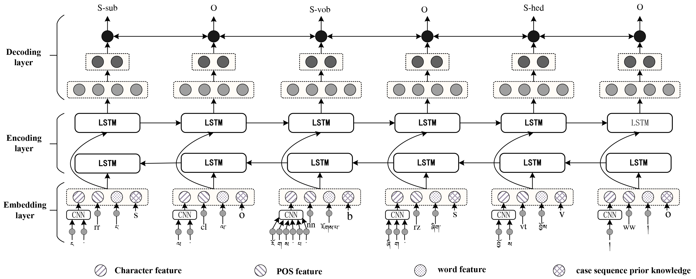

# Tibetan Syntactic Component Labeling by Integrating Case Sequence Knowledge


* [1. Introduction](#Introduction)
* [2. Requirement](#Requirement)
* [3. Advantages](#Advantages)
* [4. Usage](#Usage)
* [5. Data Format](#Data-Format)
* [6. Performance](#Performance)
* [7. Add Handcrafted Features](#Add-Handcrafted-Features)


## Introduction

Against the backdrop of Large Language Models, the syntactic parsing of low-resource languages like Tibetan remains a vital research area in language comprehension. It holds significance in constructing large datasets and understanding semantics, including tasks like data alignment in large language models, building knowledge graphs, and facilitating automatic question answering.
Tibetan syntactic analysis has been extensively studied in linguistics, leading to the development of several research paradigms for syntactic parsing. Commonly employed paradigms include deep syntactic parsing based on phrase structure [1–8] and Dependency Parsing [10–22] in the field of natural language processing. Deep syntactic parsing, also known as complete syntactic analysis, aims to uncover the connections between the constituent parts of a sentence and analyze all syntactic information within it. However, creating such datasets is labor-intensive and challenging to scale. Moreover, this paradigm performs suboptimally, especially in large-scale deep syntactic parsing tasks, and is prone to analysis errors when confronted with complex sentence patterns due to the loss of span information and syntactic identifiers on the spans. To address this challenge, we propose that integrating the shallow analysis method of syntactic constituent annotation with the morphology markers of Tibetan Case grammar  can offer an effective approach to deep syntactic parsing. This method will not only help rectify the current limitations of deep syntactic parsing by facilitating the identification of various syntactic constituents and their structural information but also mitigate the rise in complexity of analysis with increasingly complex sentences.


## Requirement

	Python: 2 or 3  
	PyTorch: 1.0 

[PyTorch 0.3 compatible version is here.](https://github.com/jiesutd/NCRFpp/tree/PyTorch0.3)


## Advantages

* Fully configurable: all the neural model structures can be set with a configuration file.
* State-of-the-art system performance: models build on NCRF++ can give comparable or better results compared with state-of-the-art models.
* Flexible with features: user can define their own features and pretrained feature embeddings.
* Fast running speed: NCRF++ utilizes fully batched operations, making the system efficient with the help of GPU (>1000sent/s for training and >2000sents/s for decoding).
* N best output: NCRF++ support `nbest` decoding (with their probabilities).


## Usage

NCRF++ supports designing the neural network structure through a configuration file. The program can run in two status; ***training*** and ***decoding***. (sample configuration and data have been included in this repository)  

In ***training*** status:
`python main.py --config demo.train.config`

In ***decoding*** status:
`python main.py --config demo.decode.config`

The configuration file controls the network structure, I/O, training setting and hyperparameters. 

***Detail configurations and explanations are listed [here](readme/Configuration.md).***

NCRF++ is designed in three layers (shown below): character sequence layer; word sequence layer and inference layer. By using the configuration file, most of the state-of-the-art models can be easily replicated ***without coding***. On the other hand, users can extend each layer by designing their own modules (for example, they may want to design their own neural structures other than CNN/LSTM/GRU). Our layer-wised design makes the module extension convenient, the instruction of module extension can be found [here](readme/Extension.md).




## Data Format

* You can refer the data format in [sample_data](sample_data). 
* NCRF++ supports both BIO and BIOES(BMES) tag scheme.  
* Notice that IOB format (***different*** from BIO) is currently not supported, because this tag scheme is old and works worse than other schemes [Reimers and Gurevych, 2017](https://arxiv.org/pdf/1707.06799.pdf). 
* The difference among these three tag schemes is explained in this [paper](https://arxiv.org/pdf/1707.06799.pdf).
* I have written a [script](utils/tagSchemeConverter.py) which converts the tag scheme among IOB/BIO/BIOES. Welcome to have a try. 


## Performance


By default, `LSTM` is bidirectional LSTM.    

|ID| Model | Nochar | CharLSTM |CharCNN   
|---|--------- | --- | --- | ------    
|1| WordLSTM | 88.57 | 90.84 | 90.73  
|2| WordLSTM+CRF | 89.45 | **91.20** | **91.35** 
|3| WordCNN |  88.56| 90.46 | 90.30  
|4| WordCNN+CRF |  88.90 | 90.70 | 90.43  


|token|model|A|P|R|F_1
|---|--------- | --- | --- | ------  | ------
|syllables|GRU+CRF|79.06|75.03|75.23|75.13
|	|CNN+CRF|78.92|75.21|75.34|75.28
|	|BiLSTM+CRF|79.14|75.53|75.66|75.60
|word|GRU+CRF|83.80|79.52|79.36|79.44
|	|CNN+CRF|83.77|79.74|79.21|79.47
|	|BiLSTM+CRF|83.86|79.86|80.21|80.03
|word+POS|GRU+CRF|85.16|82.05|82.35|82.20
|	|CNN+CRF|85.35|82.38|81.98|82.18
|	|BiLSTM+CRF|85.37|82.35|82.49|82.42
|Multi-featured token|WPCc-GRU+CRF|89.91|86.57|87.01|86.79
|	|WPCc-CNN+CRF|89.41|86.26|86.40|86.33
|	|WPCc_BiLSTM+CRF|90.67|87.00|87.33|87.16


We have compared twelve neural sequence labeling models (`{charLSTM, charCNN, None} x {wordLSTM, wordCNN} x {softmax, CRF}`) on three benchmarks (POS, Chunking, NER) under statistical experiments, detail results and comparisons can be found in our COLING 2018 paper [Design Challenges and Misconceptions in Neural Sequence Labeling](https://arxiv.org/abs/1806.04470).
 

## Add Handcrafted Features

NCRF++ has integrated several SOTA neural characrter sequence feature extractors: CNN ([Ma .etc, ACL16](http://www.aclweb.org/anthology/P/P16/P16-1101.pdf)), LSTM ([Lample .etc, NAACL16](http://www.aclweb.org/anthology/N/N16/N16-1030.pdf)) and GRU ([Yang .etc, ICLR17](https://arxiv.org/pdf/1703.06345.pdf)). In addition, handcrafted features have been proven important in sequence labeling tasks. NCRF++ allows users designing their own features such as Capitalization, POS tag or any other features (grey circles in above figure). Users can configure the self-defined features through configuration file (feature embedding size, pretrained feature embeddings .etc). The sample input data format is given at [train.cappos.bmes](sample_data/train.cappos.bmes), which includes two human-defined features `[POS]` and `[Cap]`. (`[POS]` and `[Cap]` are two examples, you can give your feature any name you want, just follow the format `[xx]` and configure the feature with the same name in configuration file.)
User can configure each feature in configuration file by using 

```Python
feature=[POS] emb_size=20 emb_dir=%your_pretrained_POS_embedding
feature=[Cap] emb_size=20 emb_dir=%your_pretrained_Cap_embedding
```

Feature without pretrained embedding will be randomly initialized.


