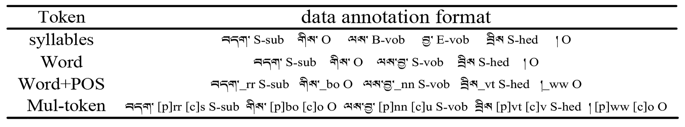

# Tibetan Syntactic Component Labeling by Integrating Case Sequence Knowledge


* [1. Introduction](#Introduction)
* [2.Statement](#Statement)
* [3. Requirement](#Requirement)
* [4. Usage](#Usage)
* [5. Data Format](#Data-Format)
* [6. Performance](#Performance)
* [7. Add Handcrafted Features](#Add-Handcrafted-Features)
* [8.Acknowledgements](#Acknowledgements)


## Introduction

Against the backdrop of Large Language Models, the syntactic parsing of low-resource languages like Tibetan remains a vital research area in language comprehension. It holds significance in constructing large datasets and understanding semantics, including tasks like data alignment in large language models, building knowledge graphs, and facilitating automatic question answering.
Tibetan syntactic analysis has been extensively studied in linguistics, leading to the development of several research paradigms for syntactic parsing. Commonly employed paradigms include deep syntactic parsing based on phrase structure and Dependency Parsing in the field of natural language processing. Deep syntactic parsing, also known as complete syntactic analysis, aims to uncover the connections between the constituent parts of a sentence and analyze all syntactic information within it. However, creating such datasets is labor-intensive and challenging to scale. Moreover, this paradigm performs suboptimally, especially in large-scale deep syntactic parsing tasks, and is prone to analysis errors when confronted with complex sentence patterns due to the loss of span information and syntactic identifiers on the spans. To address this challenge, we propose that integrating the shallow analysis method of syntactic constituent annotation with the morphology markers of Tibetan Case grammar  can offer an effective approach to deep syntactic parsing. This method will not only help rectify the current limitations of deep syntactic parsing by facilitating the identification of various syntactic constituents and their structural information but also mitigate the rise in complexity of analysis with increasingly complex sentences.


## Statement
This project is based on [NCRF++](https://github.com/jiesutd/NCRFpp) and has been modified and adapted to Tibetan. The main model architecture code in the project is basically retained. I changed the data processing code and the input data format in the model. In addition, a Tibetan syntactic component information extraction module based on case sequence was specially added.

## Requirement

	Python: 2 or 3  
	PyTorch: 1.0 

[PyTorch 0.3 compatible version is here.](https://github.com/jiesutd/NCRFpp/tree/PyTorch0.3)


## Usage

The function of NCRF++ to design the neural network structure through the configuration file is retained. The program can run in two status; ***training*** and ***decoding***. (sample configuration and data have been included in this repository)  

In ***training*** status:
`python main.py --config demo.train.config`

In ***decoding*** status:
`python main.py --config demo.decode.config`

The configuration file controls the network structure, I/O, training setting and hyperparameters. 

***Detail configurations and explanations are listed [here](readme/Configuration.md).***

The model comprises three main components: the semantic feature representation layer, the context encoding layer, and the CRF reasoning layer. In the semantic feature representation layer, local features of characters are extracted using an independent single-layer convolutional neural network. This is followed by the generation of distributed representations of words and lexical features using Word2Vec. Additionally, information regarding syntactic constituent constraints imposed by Tibetan Case sequences is integrated as prior knowledge. Moving to the encoding layer, the aforementioned features are combined and inputted into the Bi-LSTM model to capture the contextual information of each word and construct a unified semantic representation. Finally, in the inference layer, consecutive CRFs are utilized to jointly decode syntactic constituent tokens for the entire sentence.


## Data Format

* You can refer the data format in [sample_data](sample_data). 
* The NCRF++ labeling scheme is retained, and BIO and BIOS (BMES) labeling schemes are supported. 
* I wrote a  [script](utils/Tibetan_tagtoBIOES.py)  that converts annotated data in BRAT into an IOB/BIO/BIOES labeling scheme.
* the paper preprocesses data using four different primitives: syllable, word, “word+POS,” and multi-feature token. Table 4 illustrates the data annotation format of the example sentence “[ བདག་_rr ]sub [ གིས་_bo ]bo [ ལས་བྱ་_nn ]vob [ བྲིས_vt ]hed [ །_ww ]ww” (I wrote the homework) with different primitives. Here, “[p]” signifies lexical tokenization, and “[c]” represents Case sequence to the syntactic constituent constraint information.



## Performance

|token|model|A|P|R|F_1
|---|--------- | --- | --- | ------  | ------
|syllables|GRU+CRF|79.06|75.03|75.23|75.13
|	|CNN+CRF|78.92|75.21|75.34|75.28
|	|BiLSTM+CRF|79.14|75.53|75.66|75.60
|word|GRU+CRF|83.80|79.52|79.36|79.44
|	|CNN+CRF|83.77|79.74|79.21|79.47
|	|BiLSTM+CRF|83.86|79.86|80.21|80.03
|word+POS|GRU+CRF|85.16|82.05|82.35|82.20
|	|CNN+CRF|85.35|82.38|81.98|82.18
|	|BiLSTM+CRF|85.37|82.35|82.49|82.42
|Multi-featured token|WPCc-GRU+CRF|89.91|86.57|87.01|86.79
|	|WPCc-CNN+CRF|89.41|86.26|86.40|86.33
|	|WPCc_BiLSTM+CRF|90.67|87.00|87.33|87.16


## Add Handcrafted Features

NCRF++ has integrated several SOTA neural characrter sequence feature extractors: CNN ([Ma .etc, ACL16](http://www.aclweb.org/anthology/P/P16/P16-1101.pdf)), LSTM ([Lample .etc, NAACL16](http://www.aclweb.org/anthology/N/N16/N16-1030.pdf)) and GRU ([Yang .etc, ICLR17](https://arxiv.org/pdf/1703.06345.pdf)). In addition, handcrafted features have been proven important in sequence labeling tasks. NCRF++ allows users designing their own features such as Capitalization, POS tag or any other features (grey circles in above figure). Users can configure the self-defined features through configuration file (feature embedding size, pretrained feature embeddings .etc). The sample input data format is given at [train.cappos.bmes](sample_data/train.cappos.bmes), which includes two human-defined features `[POS]` and `[Cap]`. (`[POS]` and `[Cap]` are two examples, you can give your feature any name you want, just follow the format `[xx]` and configure the feature with the same name in configuration file.)
User can configure each feature in configuration file by using. In this project, we use `[p]` to represent the characteristics of Tibetan parts of speech, and `[c]` to represent the characteristics of Tibetan case particles.

```Python
feature=[p] emb_size=20 emb_dir=%your_pretrained_POS_embedding
feature=[c] emb_size=20 emb_dir=%your_pretrained_Cap_embedding
```

## Acknowledgements
Thanks to the [NCRF++](https://github.com/jiesutd/NCRFpp) project for sharing the basic code.


