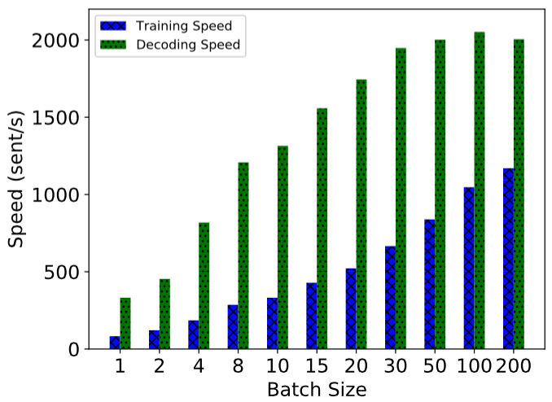
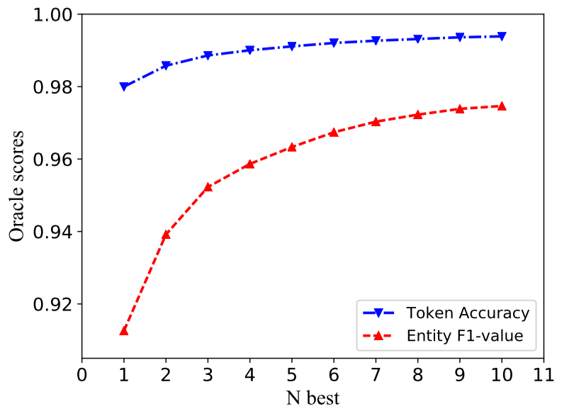

# NCRF++：一个开源的神经序列标记工具包

* [1. 简介](#简介)
* [1. 要求](#要求)
* [2. 要求](#要求)
* [3. 优势](#优势)
* [4. 用法](#Usage)
* [5. 数据格式](#数据格式)
* [6. 性能](#性能)
* [7. 添加手工制作的功能](#添加手工制作的功能)
* [8. 速度](#速度)
* [9. N最佳解码](#N最佳解码)
* [10. 再现论文结果和超参数调整](#再现论文结果和超参数调整)
* [11. 报告问题或问题](#报告问题或问题)
* [12. 引用](#引用)
* [13. 未来计划](#未来计划)
* [13. 更新](#更新)

## 简介

序列标记模型在许多NLP任务中非常流行，例如命名实体识别（NER）、词性标记（POS）和分词。最先进的序列标记模型主要利用具有输入词特征的CRF结构。LSTM（或双向LSTM）是序列标记任务中流行的基于深度学习的特征提取器。由于计算速度更快，CNN也可以使用。此外，单词内的特征也有助于表示单词，可以由字符LSTM或字符CNN结构或人类定义的神经特征捕获。
NCRF++是一个基于PyTorch的框架，可灵活选择输入功能和输出结构。使用NCRF++设计的神经序列标记模型可以通过配置文件完全配置，不需要任何代码工作。NCRF++可被视为 [CRF++](http://taku910.github.io/crfpp/) 的神经网络版本， 这是一个著名的统计CRF框架。
该框架已被[ACL 2018](https://arxiv.org/abs/1806.05626) 接受 作为演示文件。使用NCRF++的详细实验报告和分析已在 [COLING 2018](https://arxiv.org/abs/1806.04470) 上接受作为最好的纸张。
NCRF++支持三个级别的不同结构组合：字符序列表示、单词序列表示和推理层。

* 字符序列表示：字符LSTM、字符GRU、字符CNN和手工字特征。
* 单词序列表示：单词LSTM、单词GRU、单词CNN。
* 推断层：Softmax，CRF。

欢迎使用此存储库！

## 要求


	Python: 2 or 3  
	PyTorch: 1.0 

[PyTorch 0.3 compatible version is here.](https://github.com/jiesutd/NCRFpp/tree/PyTorch0.3)

## 优势

* 完全可配置：所有神经模型结构都可以用配置文件设置。
* 最先进的系统性能：与最先进的模型相比，基于NCRF++的模型可以提供相当或更好的结果。
* 灵活的特征：用户可以定义自己的特征和预训练的特征嵌入。
* 快速运行速度：NCRF++利用完全批处理操作，在GPU的帮助下使系统高效（训练>1000sents/s，解码>2000sents/s）。
* N最佳输出：NCRF++支持“nbest”解码（及其概率）。

## 用法

NCRF++支持通过配置文件设计神经网络结构。程序可以在两种状态下运行***训练***和***解码***。（示例配置和数据已包含在此存储库中）  

***培训***状态：  
`python main.py --config demo.train.config`  


在***解码***状态下：  
`python main.py --config demo.decode.config`


配置文件控制网络结构、I/O、训练设置和超参数。
***详细配置和说明见[此处](readme/Configuration.md)*** 

NCRF++设计为三层（如下所示）：字符序列层；词序层和推理层。通过使用配置文件，大多数最先进的模型都可以轻松复制***，而无需编码***。另一方面，用户可以通过设计自己的模块来扩展每一层（例如，他们可能希望设计自己的神经结构，而不是CNN/LSTM/GRU）。我们的分层设计使模块扩展更加方便，模块扩展的说明可以在[此处]（readme/extension.md）找到。


## 数据格式

* 您可以在[sample_data]（sample_data）中引用数据格式。

* NCRF++支持BIO和BIOES（BMES）标签方案。

* 请注意，IOB格式（***与BIO不同***）目前不受支持，因为此标记方案很旧，比其他方案效果更差[Reimers和Gurevych，2017](https://arxiv.org/pdf/1707.06799.pdf). 

* 这三种标签方案之间的差异在 [本文中](https://arxiv.org/pdf/1707.06799.pdf) 进行了解释.

* 我写了一个[脚本](utils/tagSchemeConverter.py)，它在IOB/BIO/BIOES之间转换标记方案。欢迎尝试。

## 性能

CONLL 2003英语NER任务的结果与相同结构的SOTA结果相比更好或更接近。 

CharLSTM + WordLSTM + CRF: 91.20 vs 90.94 的 [Lample.etc，NAACL16](http://www.aclweb.org/anthology/N/N16/N16-1030.pdf);  

CharCNN + WordLSTM + CRF: 91.35 vs 91.21 的 [Ma.等，ACL16](http://www.aclweb.org/anthology/P/P16/P16-1101.pdf). 

默认情况下，`LSTM`是双向LSTM。

|ID| Model | Nochar | CharLSTM |CharCNN   
|---|--------- | --- | --- | ------    
|1| WordLSTM | 88.57 | 90.84 | 90.73  
|2| WordLSTM+CRF | 89.45 | **91.20** | **91.35** 
|3| WordCNN |  88.56| 90.46 | 90.30  
|4| WordCNN+CRF |  88.90 | 90.70 | 90.43  

在统计实验中，我们在三个基准（POS、Chunking、NER）上比较了12个神经序列标记模型（`{charLSTM、charCNN、None}x{wordLSTM、wordCNN}x{softmax、CRF}`），详细的结果和比较可以在我们的COLING 2018论文[神经序列标记中的设计挑战和误解](https://arxiv.org/abs/1806.04470) 中找到.


## 添加手工制作的功能

NCRF++集成了几个SOTA神经特征序列特征提取器：CNN（[Ma.等，ACL16](http://www.aclweb.org/anthology/P/P16/P16-1101.pdf) )，LSTM（[灯等，NAACL16](http://www.aclweb.org/anthology/N/N16/N16-1030.pdf) )和GRU（[Yang等，ICLR17](https://arxiv.org/pdf/1703.06345.pdf) ). 此外，手工制作的特征已被证明在序列标记任务中很重要。NCRF++允许用户设计自己的功能，如资本化、POS标签或任何其他功能（上图中的灰色圆圈）。用户可以通过配置文件（特征嵌入大小、预训练特征嵌入等）配置自定义特征。示例输入数据格式在[train.capos.bmes](sample_data/train.cappos.bmes)中给出，其中包括两个人工定义的功能`[POS]`和`[Cap]`。（`[POS]`和`[Cap]`是两个示例，您可以为功能命名，只需遵循格式`[xx]`并在配置文件中使用相同的名称配置功能即可。）
用户可以使用


```Python
feature=[POS] emb_size=20 emb_dir=%your_pretrained_POS_embedding
feature=[Cap] emb_size=20 emb_dir=%your_pretrained_Cap_embedding
```

没有预训练嵌入的特征将被随机初始化。

## 速度

NCRF++使用完全批量计算实现，使其在模型训练和解码方面都非常有效。在GPU（Nvidia GTX 1080）和大批量的帮助下，用NCRF++构建的LSTMCRF模型在训练和解码状态下分别可以达到1000个和2000个句子/秒。





## N最佳解码

传统的CRF结构仅解码具有最大概率的一个标签序列（即1-最佳输出）。虽然NCRF++可以提供大量选择，但它可以解码具有最高`n`概率的`n`个标签序列（即n个最佳输出）。nbest解码得到了几种流行的**统计**CRF框架的支持。然而，据我们所知，NCRF++是唯一和第一个支持**神经**CRF模型中nbest解码的工具包。

在我们的实现中，当 nbest=10时，在NCRF++中构建的 CharCNN+WordLSTM+CRF 模型可以在 CoNLL 2003 NER任务上给出97.47%的 oracle F1值（当 nbest=1 时，F1=91.35%）。



## 再现论文结果和超参数调整

要复制COLING 2018论文中的结果，您只需在配置文件`demo.train.config`中将`iteration=1`设置为`iteration:100`并在此配置文件中配置文件目录。默认配置文件描述了`Char CNN+Word LSTM+CRF`模型，您可以通过相应地修改配置来构建自己的模型。这个演示配置文件中的参数与本文中的相同。（请注意，与`WordCNN`相关的模型需要稍有不同的参数，详情可以在我们的COLING论文中找到。）

如果你想在新的任务或数据集中使用这个框架，这里有 @ Victor0118 的一些调优[提示](readme/hyperparameter_tunning.md) 。


## 报告问题或问题

如果您想报告问题或提出问题，请在必要时附上以下材料。有了这些信息，我可以快速准确地进行讨论和提出建议。
* `log file` 
* `config file` 
* `sample data` 

## 引用
如果您在论文中使用NCRF++，请引用我们的[ACL演示论文](https://arxiv.org/abs/1806.05626):

    @inproceedings{yang2018ncrf,  
     title={NCRF++: An Open-source Neural Sequence Labeling Toolkit},  
     author={Yang, Jie and Zhang, Yue},  
     booktitle={Proceedings of the 56th Annual Meeting of the Association for Computational Linguistics},
     Url = {http://aclweb.org/anthology/P18-4013},
     year={2018}  
    }


如果您使用NCRF++的实验结果和分析，请引用我们的[COLING论文](https://arxiv.org/abs/1806.04470):


    @inproceedings{yang2018design,  
     title={Design Challenges and Misconceptions in Neural Sequence Labeling},  
     author={Yang, Jie and Liang, Shuailong and Zhang, Yue},  
     booktitle={Proceedings of the 27th International Conference on Computational Linguistics (COLING)},
     Url = {http://aclweb.org/anthology/C18-1327},
     year={2018}  
    }

## 未来计划
* 文件分类（工作）
* 支持API使用
* 在单词分割 /POS标记 /NER上上传经过训练的模型
* 启用加载预训练ELMo参数
* 添加BERT特征提取层


## 更新
* 2018-Dec-17，NCRF++v0.2，支持PyTorch 1.0
* 2018-Mar-30，NCRF++v0.1，初始版本
* 2018-Jan-06，添加结果比较。
* 2018-Jan-02，支持字符特征选择。
* 2017-Dec-06，初始版本

# NCRFpp